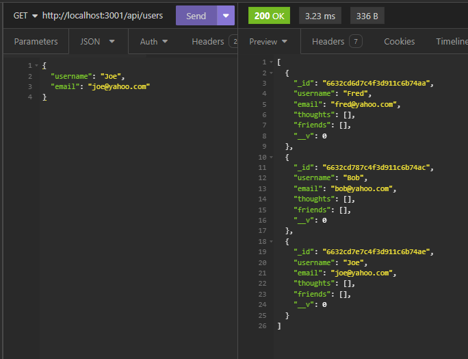
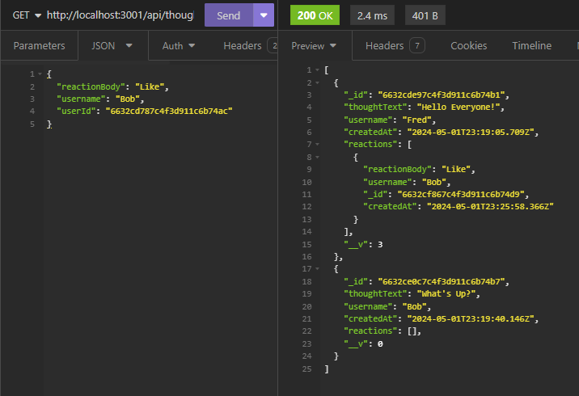
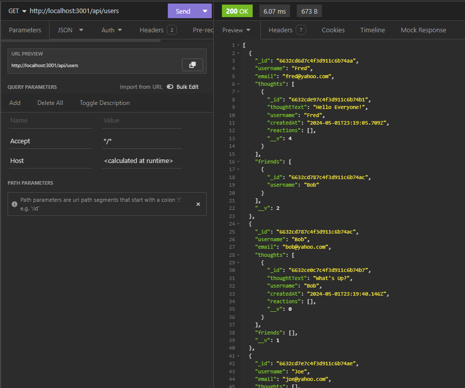
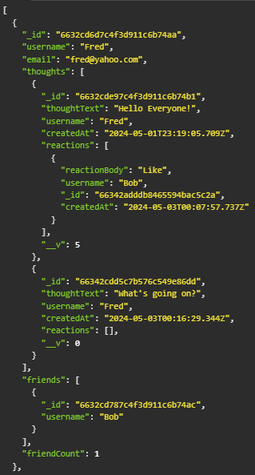

# Social-Network-API
 

## Description

This project is to create a social network backend using MongoDB. The purpose of this social network application is so that users can share their thoughts, react to friend's thoughts, and create a friend list.

The software for routing will be express.js. The database data will be structured with MongoDB. An optional date library can also be used.

## Table of Contents

- [User Story](#user-story)
- [Acceptance Criteria](#acceptance-criteria)
- [Access](#access)
- [Installation](#installation)
- [Usage](#usage)
- [Credits](#credits)
- [Questions](#questions)
- [License](#license)


## User Story

```md
As A social medial startup
I WANT an API for my social network that uses a noSQL database
SO THAT my website can handle large amounts of unstructured data.
```

## Acceptance Criteria

```md
GIVEN a social network API
WHEN I enter a command to invoke the aplication
THEN my server is started and the Mongoose models are synced to the MongoDB database
WHEN I open the API GET routes in Insomnia fo rusers and thoughts
THEN the data for each of these routes is displayed in a formatted JSON
WHEN I test API POST PUT and DELETE routes in Insomnia
THEN I am able to successfully create and delete reactions and thoughts and add and remove friends to a user's friend list.
```

## Access

To access this repository, please visit: https://github.com/avilwock/Social-Network-API

## Installation

Recommended to have MongoDBCompass installed on your system.

To install this to your computer, clone the repository.

Open the terminal, run npm install to install mongoose and express.

Run node seed to seed in the data if using the prepared data.

## Usage

To use on local server, type node index into the integrated terminal after installation is complete.

Then open insomnia or mongodb compass to view the data interactions.

To test routes, use insomnia.









## Credits

With thanks to: 

https://www.mongodb.com/docs/manual/data-modeling/

https://mongoosejs.com/docs/tutorials/virtuals.html

Logan Garland, Coding bootcamp, University of Irvine California

## Questions

For any questions, please contact me at: avilwock@gmail.com

## License

MIT License